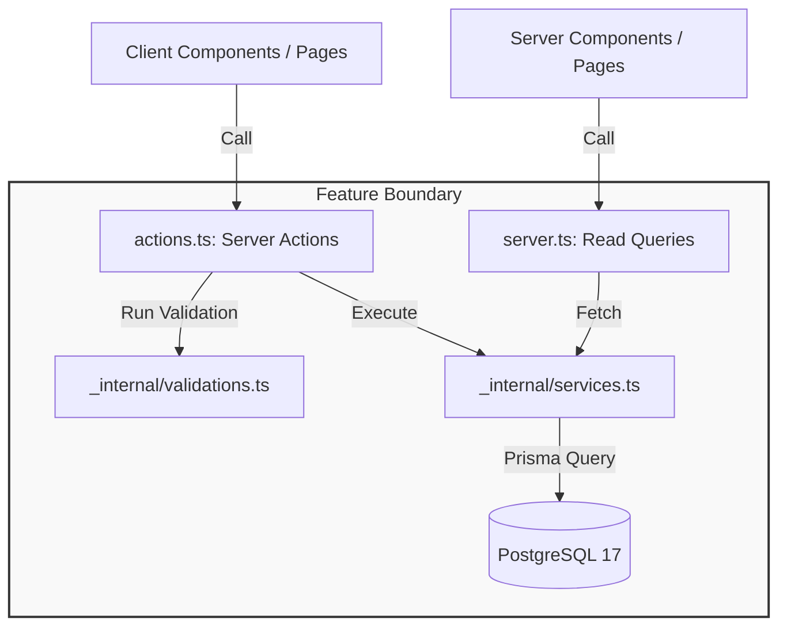
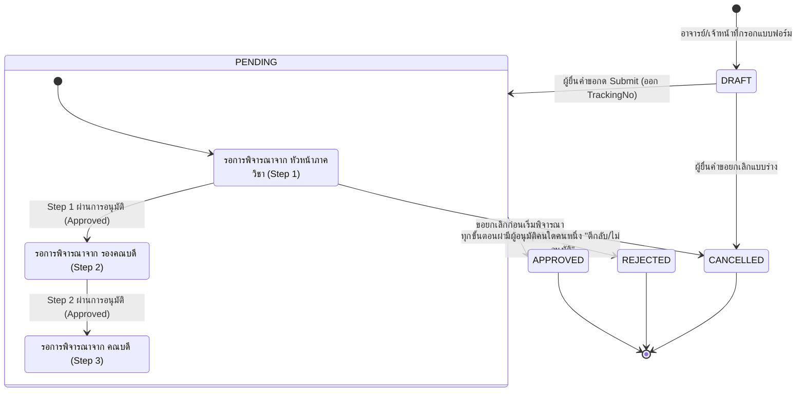
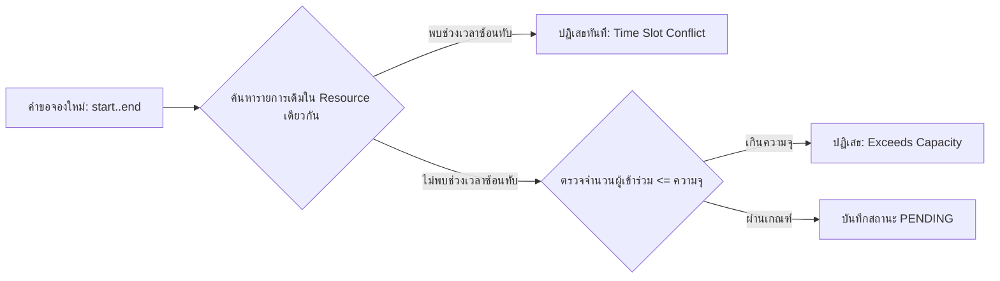

# Technical Architecture & System Flow
## สถาปัตยกรรมเชิงเทคนิคและการไหลของข้อมูล (Faculty Web Platform)

เอกสารนี้อธิบายสถาปัตยกรรมระดับระบบ, โครงสร้างโฟลเดอร์, การแมปเส้นทาง (Route Mapping), ผังการไหลของข้อมูล (Data Flow), และ State Machine ของระบบ

---

## 1. ผังโครงสร้างระดับโมดูล (Module Structure)

```
src/
├── app/
│   ├── (portal)/                    # [หน้าบ้าน - สาธารณะ]
│   │   ├── page.tsx                 # หน้าแรกคณะ (Hero, ข่าวเด่น, ลิงก์ด่วน)
│   │   ├── news/                    # /news, /news/[slug]
│   │   ├── personnel/               # /personnel, /personnel/[id]
│   │   ├── curriculum/              # /curriculum, /curriculum/[id]
│   │   └── calendar/                # /calendar (ตารางใช้ห้อง/รถ)
│   └── (admin)/                     # [หลังบ้าน - เจ้าหน้าที่/อาจารย์]
│       ├── news/                    # /admin/news (จัดการข่าวสาร)
│       ├── personnel/               # /admin/personnel (จัดการบุคลากร/ภาควิชา)
│       ├── curriculum/              # /admin/curriculum (จัดการหลักสูตร/รายวิชา)
│       ├── documents/               # /admin/documents (ยื่นคำขอ/ติดตาม/อนุมัติ)
│       └── bookings/                # /admin/bookings (จัดการจองห้องและยานพาหนะ)
├── features/
│   ├── news/                        # โมดูลข่าวสาร
│   ├── personnel/                   # โมดูลบุคลากร
│   ├── curriculum/                  # โมดูลหลักสูตร
│   ├── document-flow/               # โมดูลอนุมัติเอกสาร
│   └── booking/                     # โมดูลจองทรัพยากร
├── shared/                          # โมดูลกลาง (Liyon UI, Utilities, Security)
├── permissions.ts                   # ศูนย์รวมสิทธิ์ (Permission Registry)
└── i18n/                            # ศูนย์รวมพจนานุกรมแปล 2 ภาษา
```

---

## 2. การแบ่งชั้นภายในโมดูล (Feature Internal Layering)

แต่ละโฟลเดอร์ใน `src/features/<feature>/` ถูกแบ่งชั้นความรับผิดชอบอย่างเคร่งครัด:



---

## 3. ผังสถานะ State Machine: ระบบอนุมัติเอกสาร (Document Workflow)

ระบบอนุมัติเอกสารทำงานในรูปแบบ **Multi-step Sequential State Machine**:



---

## 4. ตรรกะการตรวจสอบการจองทรัพยากร (Zero-Overlap Booking Logic)

การตรวจสอบการจองห้องประชุมและยานพาหนะป้องกันการชนกัน (Conflict Detection) บนเงื่อนไขทางคณิตศาสตร์ในระดับ Database Transaction:



---

## 5. ทะเบียนสิทธิ์ของระบบ (Permission Registry)

สิทธิ์ทั้งหมดที่จะต้องเพิ่มใน [`src/permissions.ts`](src/permissions.ts):

| โมดูล | รหัสสิทธิ์ (Permission Code) | คำอธิบาย |
| :--- | :--- | :--- |
| **News** | `news:read` | ดูข่าวสารภายในและสถิติการเข้าชม |
| | `news:manage` | สร้าง แก้ไข และลบเนื้อหาข่าวสาร |
| | `news:publish` | อนุมัติการเผยแพร่หรือปลดข่าวออกจากหน้าบ้าน |
| **Personnel** | `personnel:read` | ดูข้อมูลบุคลากรในหลังบ้าน |
| | `personnel:manage` | จัดการข้อมูลคณาจารย์ ลำดับผู้บริหาร และภาควิชา |
| | `personnel:update-self` | อาจารย์แก้ไขข้อมูลส่วนตัวและห้องพักของตนเอง |
| **Curriculum** | `curriculum:read` | ดูข้อมูลโครงสร้างหลักสูตรและรายวิชา |
| | `curriculum:manage` | เพิ่ม แก้ไข จัดกลุ่มวิชา และอัปเดตเล่มหลักสูตร |
| **Documents** | `documents:create` | ยื่นคำขอเอกสารและติดตามสถานะของตนเอง |
| | `documents:approve` | พิจารณา ลงความเห็น และอนุมัติ/ตีกลับเอกสาร |
| | `documents:manage-all` | เจ้าหน้าที่งานสารบรรณดูแลเอกสารทั้งหมด |
| **Booking** | `booking:view` | ดูรายการจองทั้งหมดในหลังบ้าน |
| | `booking:create` | ยื่นคำขอจองห้องประชุมหรือยานพาหนะ |
| | `booking:manage` | พิจารณาอนุมัติคำขอจอง และจัดการทรัพยากรห้อง/รถ |
